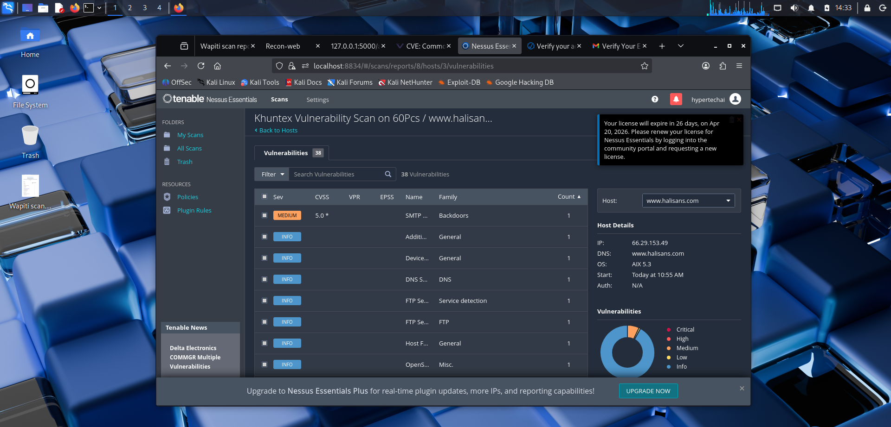
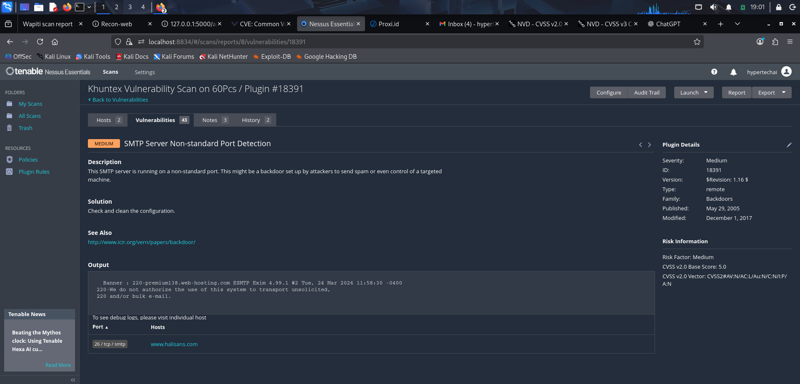
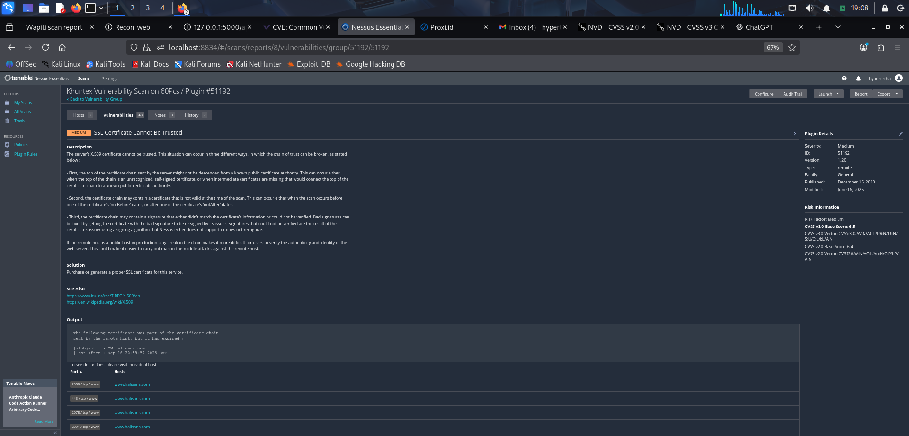
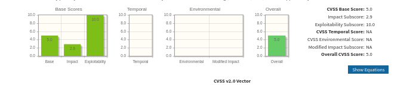
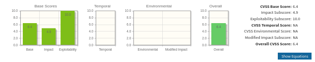

# Nessus-Based Vulnerability Risk Assessment — halisans.com

> **Target shown in host results:** `www.halisans.com` — `66.29.153.49`  
> **Assessment period:** March 2026  
> **Tool:** Tenable Nessus Essentials 10.11.3 on Kali Linux  
> **Policy shown in scan history:** Basic Network Scan  
> **Purpose:** Academic vulnerability assessment, evidence review, and risk treatment planning

## Executive summary

This project reviews Nessus scan evidence and develops treatment recommendations for two scanner-reported findings: an SMTP service on TCP port 26 and a certificate trust issue involving an expired certificate in the presented chain.

Both findings are displayed as **Medium** in their plugin-detail screenshots. The SMTP finding shows a CVSS v2.0 base score of **5.0**. A separate calculator screenshot shows **6.4**, but its metric selections and relationship to the certificate finding are not fully documented.

These findings require configuration and endpoint validation. The evidence does not demonstrate a backdoor, open mail relay, intercepted communications, or successful exploitation. Business risk ratings remain provisional because service ownership, asset criticality, compensating controls, and organizational risk appetite were not established.

This repository develops the Nessus analysis associated with the [footprinting and web assessment project](https://github.com/Yem-Tech/Vulnerability-Assessment-Report-halisans.com). It is not presented as a separate scan campaign of the same target.

## Contents

- [Scope and assessment context](#scope-and-assessment-context)
- [Evidence inventory](#evidence-inventory)
- [Assessment methodology](#assessment-methodology)
- [Scanner-reported findings](#scanner-reported-findings)
- [CVSS and contextual risk](#cvss-and-contextual-risk)
- [Academic risk matrix](#academic-risk-matrix)
- [Risk register and treatment plan](#risk-register-and-treatment-plan)
- [Verification and closure criteria](#verification-and-closure-criteria)
- [Limitations](#limitations)
- [Screenshot checklist](#screenshot-checklist)
- [References](#references)

## Scope and assessment context

| Field | Evidence-based description |
|---|---|
| Target host | `www.halisans.com` |
| Observed IPv4 address | `66.29.153.49` |
| Scanner version | Nessus 10.11.3, shown during installation |
| Scan policy | Basic Network Scan, shown in a running-scan view |
| Authentication | Host view displays `Auth: N/A`; no authenticated assessment is demonstrated |
| OS identification | Nessus displays `AIX 5.3`; not independently verified |
| Scan dates | March 2026, based on the supplied evidence |
| Assessment status | Historical screenshot-based review; no remediation or retest demonstrated |

The screenshots include differently named scan views. A scan label containing “60 PCs” is not evidence that 60 hosts were assessed. A full export and scan configuration would be needed to reconcile all scan runs, targets, and result counts.

## Evidence inventory

The host-results screenshot shows **38 finding entries** for `www.halisans.com`. The detailed plugin screenshots display **43 entries** in a view containing **two hosts**. The screenshots do not establish whether these views represent the same run or different histories.

Do not combine these counts or describe all entries as confirmed vulnerabilities. Informational service and configuration observations are included. An exact severity distribution cannot be established from the visible rows and chart alone.



Other evidence includes:

- An SMTP plugin-detail screenshot with a service banner and port.
- A certificate plugin-detail screenshot with expired-certificate output and listed endpoints.
- Two CVSS v2.0 calculator screenshots.
- Setup and running-scan screenshots, which document workflow but do not establish final scan completion.

## Assessment methodology

1. **Identify:** Read host results and individual plugin outputs, preserving the target and port for each observation.
2. **Review technical severity:** Record the scanner's displayed severity and supported CVSS information without treating CVSS as a business-risk score.
3. **Evaluate context:** Identify the missing information needed to assess likelihood and business impact.
4. **Prioritize treatment:** Recommend validation and configuration review based on the observed condition.
5. **Define closure:** Specify evidence needed to confirm remediation, expected configuration, or a false positive.

“Scanner-reported” means the condition appears in the supplied tool output. “Independently validated” would require additional evidence; neither finding is labelled independently validated here.

## Scanner-reported findings

### V-01: SMTP Server Non-standard Port Detection

| Field | Observed value |
|---|---|
| Plugin ID | 18391 |
| Plugin family | Backdoors |
| Scanner severity | Medium |
| Host | `www.halisans.com` |
| Port | 26/TCP |
| CVSS v2.0 base score | 5.0 |
| CVSS v2.0 vector shown | `AV:N/AC:L/Au:N/C:N/I:P/A:N` |
| Evidence status | Service detected; purpose and security configuration not validated |

**Observed output**

```text
220-premium138.web-hosting.com ESMTP Exim 4.99.1 #2
220-We do not authorize the use of this system to transport unsolicited,
220 and/or bulk e-mail.
Port: 26/tcp/smtp
Host: www.halisans.com
```



**Interpretation**

Nessus detected an SMTP service on a non-standard port and captured an Exim banner. Although the plugin belongs to the Backdoors family and describes a possible backdoor scenario, neither its family nor the port proves malicious activity. The banner does not establish that the service is an open relay or affected by a specific Exim vulnerability.

**Conditional risk statement**

If this listener is unnecessary, improperly restricted, or permits unauthorized relay, it could increase exposure to mail abuse and associated operational or reputational consequences. Those conditions were not demonstrated by the supplied evidence.

**Recommended treatment**

- Confirm the service's owner, purpose, and expected port with the hosting administrator.
- Review relay permissions, authentication where appropriate, access restrictions, and mail-service monitoring.
- Restrict or remove the listener if it is unnecessary and the change is approved by its owner.
- Validate software version and patch status against applicable advisories before claiming a CVE match.

### V-02: SSL Certificate Cannot Be Trusted

| Field | Observed value |
|---|---|
| Finding | SSL Certificate Cannot Be Trusted |
| Reference plugin | Tenable 51192; ID not visible in the supplied certificate screenshot |
| Scanner severity | Medium |
| Host | `www.halisans.com` |
| Listed TCP ports | 443, 2078, 2080, 2091 |
| Certificate subject | `CN=halisans.com` |
| Not After value shown | September 16, 2025, 22:59:59 GMT |
| Evidence status | Scanner reported an expired certificate in the chain; per-endpoint validation pending |

**Observed output**

```text
The following certificate was part of the certificate chain
sent by the remote host, but it has expired:

Subject   : CN=halisans.com
Not After : Sep 16 22:59:59 2025 GMT
```

The screenshot lists `www.halisans.com` on TCP ports 2080, 443, 2078, and 2091 beneath this finding.



**Interpretation**

The scanner reports a certificate-chain trust problem with an expired certificate. Validate the full chain, server name indication (SNI), hostname matching, client trust store, and scanner time on each listed endpoint before finalizing the cause and scope.

Certificate expiration can cause clients to reject connections or show trust warnings. It does not, by itself, remove TLS encryption or demonstrate interception. Users bypassing validation failures could weaken assurance of the server's identity, depending on the client and surrounding conditions.

**Conditional risk statement**

If production clients receive an expired or otherwise invalid chain, they may experience connection failures or trust warnings. If users or applications bypass those checks, server-authentication assurance may be reduced. No interception or credential exposure was demonstrated.

**Recommended treatment**

- Inspect the certificate chain served by each endpoint using the intended hostname and SNI.
- Renew or replace expired certificates and correct incomplete or incorrect chain deployment.
- Confirm hostname coverage and validity periods.
- Introduce certificate-expiry monitoring and renewal automation where supported.
- Verify deployment across all relevant listeners and retest with a trusted client.

## CVSS and contextual risk

CVSS describes technical vulnerability severity. It does not directly calculate exploitation probability, business impact, or organizational risk appetite.

| Evidence | What is supported | Limitation |
|---|---|---|
| SMTP plugin screenshot | CVSS v2.0 base score 5.0 and vector | Scanner rating; no business-context assessment |
| Calculator image 001 | Base 5.0, impact 2.9, exploitability 10.0 | Metric selections are not shown; matches the SMTP plugin score |
| Calculator image 002 | Base 6.4, impact 4.9, exploitability 10.0 | Vector and target association are not demonstrated |
| Certificate plugin screenshot | Scanner severity Medium | CVSS score and vector are not visible |
| Running-scan view | Severity base labelled CVSS v3.0 | Does not independently establish each finding's v3.0 score |




The 6.4 calculator output is retained as scoring practice, not assigned as a verified certificate finding score. No CVSS v3.0 score is claimed from the supplied certificate evidence. A maximum exploitability subscore does not establish that exploitation is highly probable.

## Academic risk matrix

The following is a **hypothetical learning model**, not an approved organizational risk policy. Likelihood and impact must be assessed using documented context rather than copied directly from CVSS.

| Rating | Likelihood | Business impact |
|---|---|---|
| Low (1) | Adverse event is unlikely given exposure and effective controls | Limited disruption or consequence |
| Medium (2) | Adverse event is plausible under identified conditions | Meaningful but contained operational or data consequence |
| High (3) | Evidence supports a likely adverse event with weak or absent controls | Major disruption or consequence to critical assets |

**Custom formula:** `Contextual score = Likelihood + Impact`

| Score | Model rating |
|---|---|
| 2 | Low |
| 3–4 | Medium |
| 5–6 | High |

### Consistent matrix

| Likelihood / Impact | Low (1) | Medium (2) | High (3) |
|---|---|---|---|
| High (3) | Medium — 4 | High — 5 | High — 6 |
| Medium (2) | Medium — 3 | Medium — 4 | High — 5 |
| Low (1) | Low — 2 | Medium — 3 | Medium — 4 |

Neither finding is plotted as an established business risk because the required context is unavailable. For illustration only, a hypothetical likelihood of 3 and impact of 2 would produce **5**, not 6, for either finding. This example is not a rating of the website.

No actual organizational acceptance threshold, senior approval requirement, or remediation deadline is asserted. These decisions belong to the responsible service and risk owners.

## Risk register and treatment plan

| ID | Observation | Technical severity | Contextual risk | Proposed treatment | Proposed owner role | Status |
|---|---|---|---|---|---|---|
| V-01 | SMTP service on TCP 26 | Scanner-rated Medium; CVSS v2.0 5.0 | Pending service and control review | Validate purpose; mitigate or remove unnecessary exposure | Hosting/mail administrator | Open: validation required |
| V-02 | Certificate-chain trust issue with expired certificate output | Scanner-rated Medium | Pending endpoint and client-impact review | Validate chain; correct confirmed certificate deployment issues | Hosting/TLS administrator | Open: validation required |

The roles above are suggested responsibilities, not assignments to named people. Neither finding is accepted, remediated, or closed based on the supplied evidence.

Certificate validation should receive prompt attention because invalid chains can affect client connectivity. The SMTP finding calls for configuration review; its non-standard port alone does not justify an emergency compromise response. Final priorities and deadlines should reflect confirmed impact and agreed service requirements.

## Verification and closure criteria

### V-01

- Record the listener's owner and approved business purpose.
- Review configuration evidence for access restrictions and relay controls.
- If unnecessary, verify removal or restriction from the relevant network vantage point.
- If expected, document why the plugin finding is an acceptable configuration observation and obtain the appropriate owner decision.
- Retain rescan output. An intentional service may continue to trigger the detection plugin after appropriate controls are confirmed.

### V-02

- Record certificate subject, issuer, hostname coverage, validity dates, and full chain for each listed endpoint.
- Confirm successful validation using intended hostname/SNI and a trusted client.
- Retest with Nessus and review any remaining plugin output.
- Record expiry monitoring and renewal verification.

A change ticket or proposed recommendation is not evidence of successful closure.

## Limitations

- The review relies on screenshots rather than a complete `.nessus` export and scan configuration.
- Differing result counts and scan views cannot be reconciled reliably from the supplied images.
- Setup and running-scan screenshots show a feed/license error; its effect on final results is not established.
- The supplied images do not demonstrate final completion of every scan run.
- No authenticated configuration assessment, exploitation, open-relay validation, or interception test is demonstrated.
- OS and service fingerprints require independent confirmation.
- Business criticality, actual likelihood, compensating controls, and organizational risk appetite were not established.
- No remediation or retest evidence was supplied.
- Findings describe March 2026 observations, not the website's current security condition.

## Screenshot checklist

Create a folder named **`Screenshots`** beside `README.md`. Upload these five files using their exact names:

| Filename | Contents | Use |
|---|---|---|
| `12-Nessus_Vuln_Scan_result.png` | Host-results view showing 38 entries | Evidence inventory |
| `101-Nessus_vuln.png` | SMTP plugin 18391 details, port 26, and Exim banner | V-01 |
| `102-Nessus_ssl_cert_.png` | Certificate finding with expired-certificate output | V-02 |
| `001-Vulnerability_Calc_cvss2.0.png` | CVSS v2.0 calculator output: 5.0 | Scoring evidence |
| `002-vuln_Calc_cvss2.0.png` | CVSS v2.0 calculator output: 6.4 | Scoring practice and limitations |

Optional setup and workflow images include `12-Nessus_essentials_welcome.png`, `12-Nessus_vuln_scan.png`, and `12-Nessus_vuln_scanning.png`. They are not substitutes for final results and are not required by the image links above. Duplicate “Copy” files need not be added.

## Skills demonstrated

- Nessus scan-output interpretation and plugin evidence review.
- Separation of informational observations, technical severity, and contextual risk.
- CVSS scoring review and consistent custom matrix construction.
- Conditional risk statements and remediation recommendations.
- Risk-register documentation and evidence-based closure criteria.

## References

- [Tenable plugin 18391: SMTP Server Non-standard Port Detection](https://www.tenable.com/plugins/nessus/18391)
- [Tenable plugin 51192: SSL Certificate Cannot Be Trusted](https://www.tenable.com/plugins/nessus/51192)
- [Tenable guidance on resolving plugin 51192](https://docs.tenable.com/whitepapers/useful-plugins/Content/UsefulPlugins/Resolving51192.htm)
- [FIRST CVSS v2.0 guide](https://www.first.org/cvss/v2/guide)
- [FIRST CVSS v3.0 specification](https://www.first.org/cvss/v3.0/specification-document)

## Assessment context

The original project notes describe an authorized academic assessment. Screenshots support technical observations but do not establish permission boundaries. Any future testing must remain within the approved targets, methods, and timeframe.

This report is an educational portfolio artifact. It does not claim a comprehensive penetration test, an approved enterprise risk decision, or demonstrated exploitation.
